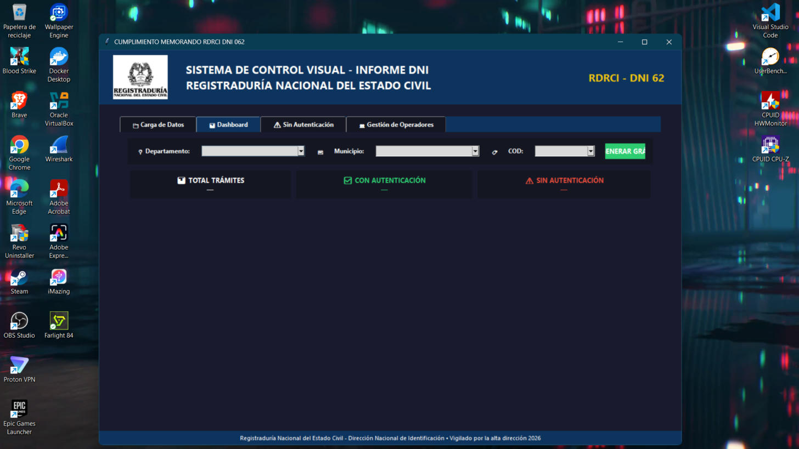
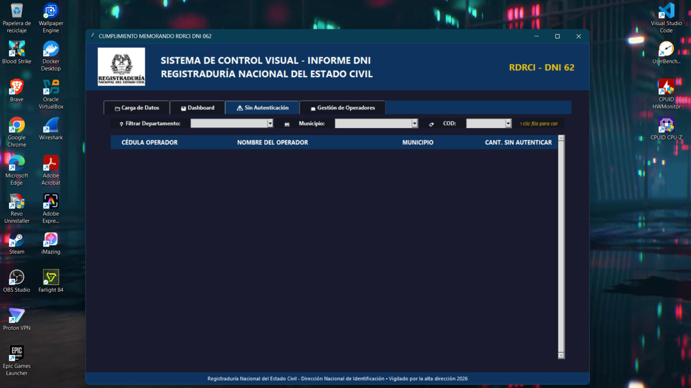
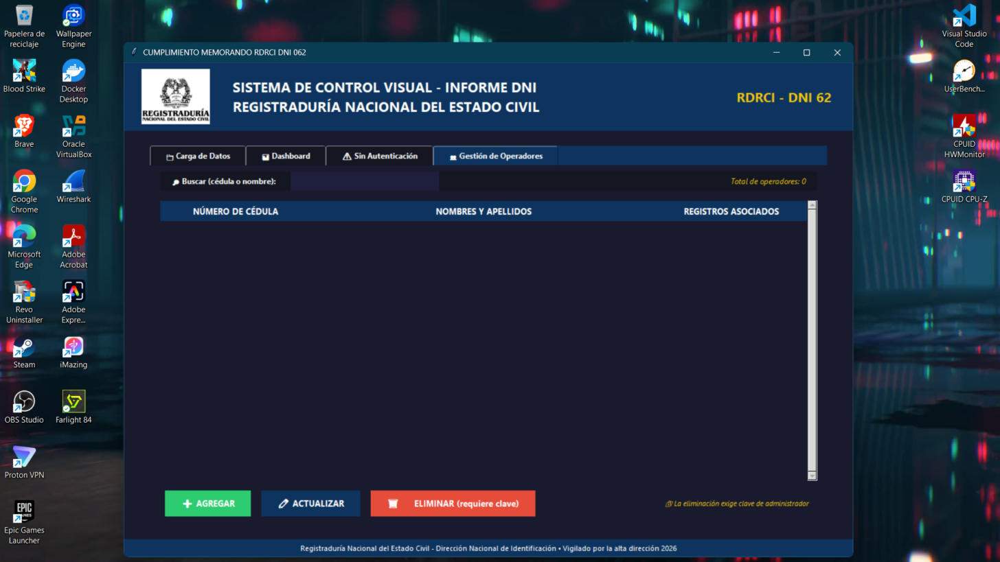

<div align="center">

# 🇨🇴 Sistema de Control Visual — Informe DNI
### Cumplimiento Memorando RDRCI DNI 062

**Registraduría Nacional del Estado Civil · Dirección Nacional de Identificación**


*Aplicación de escritorio para unificar, analizar y visualizar el cumplimiento de autenticación biométrica de operadores a nivel nacional.*

</div>

---

## 📸 Vista previa

| Carga de Datos | Dashboard |
|:---:|:---:|
|  |  |

| Sin Autenticación | Gestión de Operadores |
|:---:|:---:|
|  |  |

---

## ✨ Funcionalidades principales

🗂️ **Unificación de datos** — Consolida múltiples bases oficiales en Excel (`.xlsx`, `.xls`, `.xlsm`) junto con el archivo maestro de operadores en un solo DataFrame limpio y normalizado.

📊 **Dashboard interactivo** — Gráfico Top 10 de operadores con barras apiladas (Con / Sin Autenticación), tarjetas KPI con totales y porcentaje de cumplimiento, filtrable por **Departamento**, **Municipio** y **COD**.

⚠️ **Detalle Sin Autenticación** — Tabla dinámica con estilo cebra que resume los trámites sin autenticar por operador. Doble clic sobre una fila permite corregir nombres faltantes al instante.

👥 **Gestión de operadores (CRUD)** — Agregar, actualizar y eliminar operadores con búsqueda en vivo por cédula o nombre. La eliminación está **protegida con clave de administrador** 🔐.

📥 **Exportación** — Descarga el informe consolidado a Excel con un clic.

🎨 **Interfaz institucional** — Tema oscuro con colores corporativos RNEC, botones redondeados personalizados y tablas con filas alternadas.

---

## 🖥️ Tecnologías

| Tecnología | Uso |
|---|---|
| **Python 3.9+** | Lenguaje principal |
| **Tkinter / ttk** | Interfaz gráfica de escritorio |
| **Pandas** | Procesamiento y unificación de datos |
| **Matplotlib** | Gráficos del dashboard |
| **Pillow (PIL)** | Manejo del escudo institucional |
| **openpyxl** | Lectura/escritura de archivos Excel |

---

## 🚀 Instalación y uso

**1. Clona el repositorio**
```bash
git clone https://github.com/TU_USUARIO/TU_REPOSITORIO.git
cd TU_REPOSITORIO
```

**2. Instala las dependencias**
```bash
pip install pandas matplotlib pillow openpyxl
```

**3. Ejecuta la aplicación**
```bash
python main.py
```

**4. Flujo de trabajo**

1. 📄 Selecciona los archivos **BASE** oficiales (puedes elegir varios).
2. 📋 Selecciona el archivo maestro de **NOMBRES** de operadores.
3. ⚡ Pulsa **UNIFICAR DATOS**.
4. 📊 Explora el **Dashboard** con los filtros de Departamento / Municipio / COD.
5. 📥 Descarga el informe consolidado en Excel.

> 💡 Coloca el archivo `Escudo.png` en la misma carpeta del script para mostrar el logo institucional en la cabecera.

---

## 📁 Estructura de datos esperada

Los archivos Excel deben contener (los nombres de columna se normalizan automáticamente a mayúsculas):

| Columna | Descripción |
|---|---|
| `CCOPERADOR` | Cédula del operador |
| `NOMBRE` | Nombres y apellidos |
| `DEPARTAMENTO` / `MUNICIPIO` | Ubicación del trámite |
| `COD` | Código de oficina/registraduría |
| `CON AUTENTICACION` | Trámites autenticados |
| `SIN AUTENTICACION` | Trámites sin autenticar |
| `CUMPLIMIENTO` | Porcentaje de cumplimiento (0–1) |

---

## 🔐 Seguridad

Las operaciones críticas (eliminación de registros) requieren **clave de administrador**, configurable en la constante `CLAVE_SEGURIDAD` del código fuente. Cámbiala antes de usar la aplicación en producción.

---

## 🗒️ Historial de versiones

| Versión | Cambios |
|---|---|
| **1.1** | Tarjetas KPI de totales en el Dashboard, filtro por COD, corrección de fugas de memoria en gráficos |
| **1.0** | Versión inicial: unificación, dashboard, detalle sin autenticación y CRUD de operadores |

---

## 👨‍💻 Autor

**Ing. Miguel Bohórquez**
📧 miguel.bohorquezc@cecar.edu.co

---

<div align="center">

*Desarrollado para la Dirección Nacional de Identificación — RNEC · 2026*

</div>

---
---

<div align="center">

## 🌎 English Summary

</div>

**DNI Visual Control System** is a Python desktop application built for Colombia's National Civil Registry (RNEC) to monitor biometric authentication compliance of field operators.

**Key features:** merges multiple official Excel data sources into a unified dataset · interactive dashboard (Top 10 operators, stacked bars, KPI cards) with Department / Municipality / Office-code filters · drill-down table of unauthenticated transactions with inline name correction · full operator CRUD protected by an admin password · one-click consolidated Excel export · dark institutional UI theme built with Tkinter.

**Stack:** Python, Tkinter, Pandas, Matplotlib, Pillow, openpyxl.

```bash
pip install pandas matplotlib pillow openpyxl
python main.py
```
